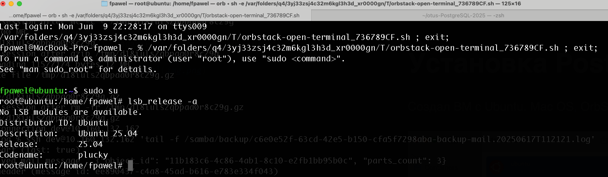
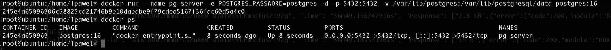
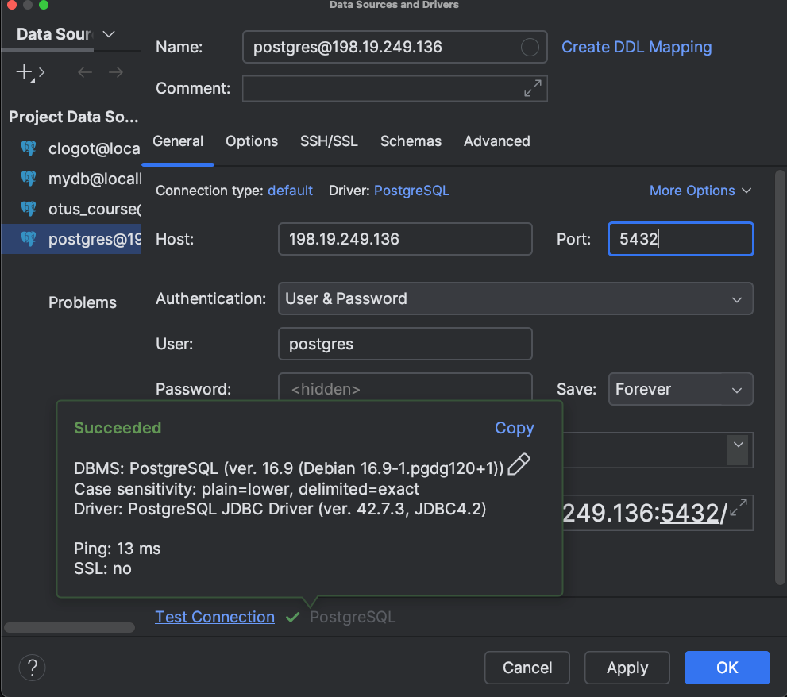
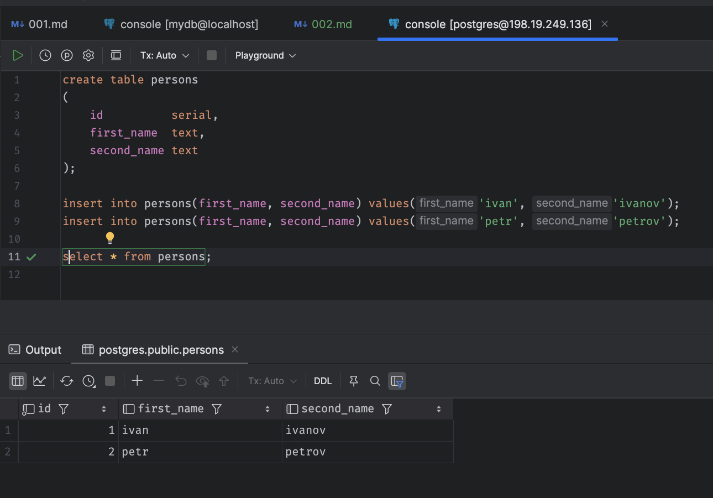
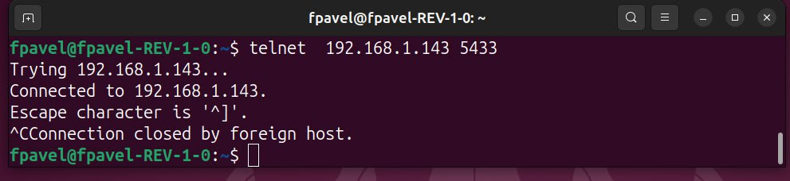
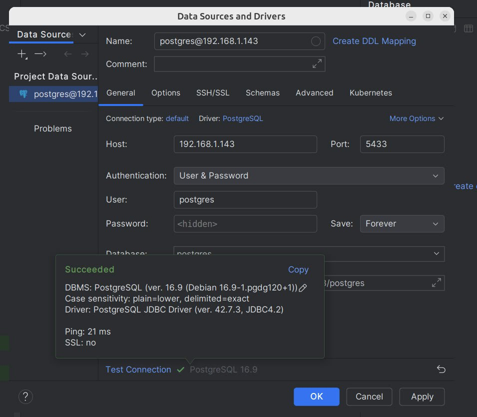
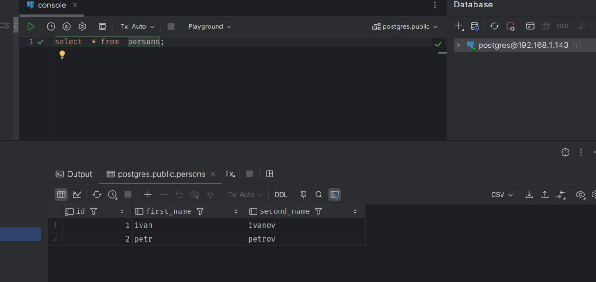
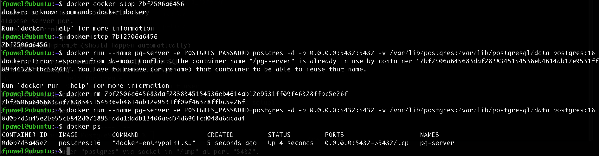
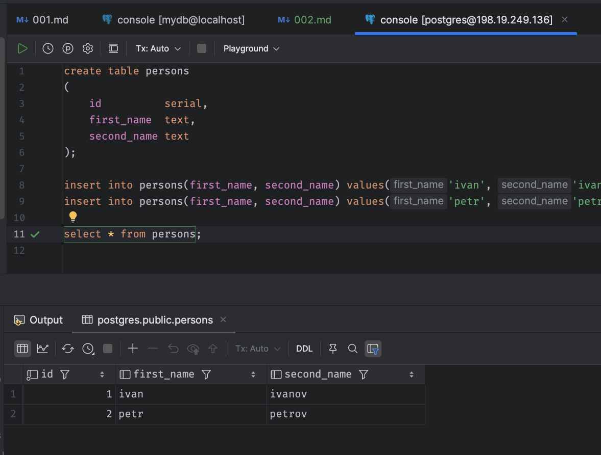

# Установка PostgreSQL 

Создал ВМ с Ubuntu. Mac OS, OrbStack 

Установил докер в ВМ. Сделал каталог `/var/lib/postgres` и развернул контейнер с PostgreSQL 16, смонтировав в него `/var/lib/postgresql`

Подключился из локального клиента `DataGrip`

Создал таблицу, добавил в неё записи

Пробросил порт для подключения с другого ноутбука

`socat TCP-LISTEN:5433,fork TCP:198.19.249.136:5432`

Проверил что порт доступен на другом ноутбуке 

Подключился 

Выполнил запрос

Удалил контейнер с сервером и создал его заново

Подключился снова из контейнера с клиентом к контейнеру с сервером и убедился, что данные остались на месте

