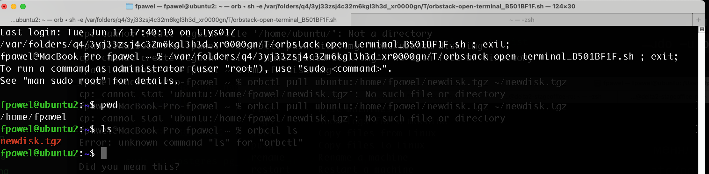

# Установка и настройка PostgreSQL

Создал ВМ с Ubuntu. Mac OS, OrbStack 


Поставил на нее PostgreSQL 17
```shell
sudo apt install -y postgresql-common
sudo /usr/share/postgresql-common/pgdg/apt.postgresql.org.sh
sudo apt install postgresql-17
```
Убедился что PostgreSQL запущен 


Зашёл в psql от юзера postgres

```shell
sudo -u postgres psql
psql (17.5 (Ubuntu 17.5-0ubuntu0.25.04.1))
Type "help" for help.

postgres=# create table test(c1 text);
CREATE TABLE
postgres=# insert into test values('1');
INSERT 0 1
postgres=# \q
```

Остановил кластер

```bash
sudo -u postgres pg_ctlcluster 17 main stop
Warning: stopping the cluster using pg_ctlcluster will mark the systemd unit as failed. Consider using systemctl:
  sudo systemctl stop postgresql@17-main
```

Создал новый диск размером 10GB

```bash
dd if=/dev/zero of=disk.img bs=1M count=10240
10240+0 records in
10240+0 records out
10737418240 bytes transferred in 7.960245 secs (1348880372 bytes/sec)

sudo losetup -fP disk.img
```

Примонтировал его в ВМ как loop device 

```bash
sudo mkfs.ext4 /dev/loop0  # X = номер устройства
mke2fs 1.47.2 (1-Jan-2025)
Discarding device blocks: done                            
Creating filesystem with 2621440 4k blocks and 655360 inodes
Filesystem UUID: fbbc104f-e19b-47c4-8aed-11a817ce99c7
Superblock backups stored on blocks: 
	32768, 98304, 163840, 229376, 294912, 819200, 884736, 1605632

Allocating group tables: done                            
Writing inode tables: done                            
Creating journal (16384 blocks): done
Writing superblocks and filesystem accounting information: done 

sudo mkdir -p  /mnt/newdisk
sudo mount /dev/loop0 /mnt/newdisk
```

Сделал пользователя `postgres` владельцем `/mnt/newdisk` 

```
sudo chown -R postgres:postgres /mnt/newdisk/
```

Перенёс содержимое `/var/lib/postgresql/17/` в `/mnt/newdisk/`
```
sudo mv /var/lib/postgresql/17/ /mnt/newdisk/
```
Попытался запустить кластер  
```sudo -u postgres pg_ctlcluster 17 main start```
Не удалось 
```
Error: /var/lib/postgresql/17/main is not accessible or does not exist
```

Поменял значение параметра `data_directory` в файле `/etc/postgresql/17/main/postgresql.conf` с `/var/lib/postgresql/17/main` на `/mnt/newdisk/17/main`


Запустил постгрес
```
sudo -u postgres pg_ctlcluster 17 main start
Warning: the cluster will not be running as a systemd service. Consider using systemctl:
  sudo systemctl start postgresql@17-main
```

Убедился что он стартанул


Проверил через `psql` содержимое ранее созданной таблицы


Внутри ВМ упаковал содержимое `/mnt/newdisk`


 С локальной машины вытащил архив


Создал вторую ВМ ubuntu2 и закинул в неё архив

```
orbctl push --machine ubuntu2 newdisk.tgz /home/fpawel/newdisk.tgz
```


Распаковал архив в каталог `/mnt/newdisk` 


Здесь же во второй ВМке стопнул постгрес, так же поменял значение параметра `data_directory` в файле `/etc/postgresql/17/main/postgresql.conf` с `/var/lib/postgresql/17/main` на `/mnt/newdisk/17/main` и стартанул 


Зашёл в psql от юзера postgres и убедился что таблица test есть


```shell
sudo -u postgres psql
psql (17.5 (Ubuntu 17.5-0ubuntu0.25.04.1))
Type "help" for help.

postgres=# select * from test;
 c1 
----
 1
(1 row)

postgres=# 
```