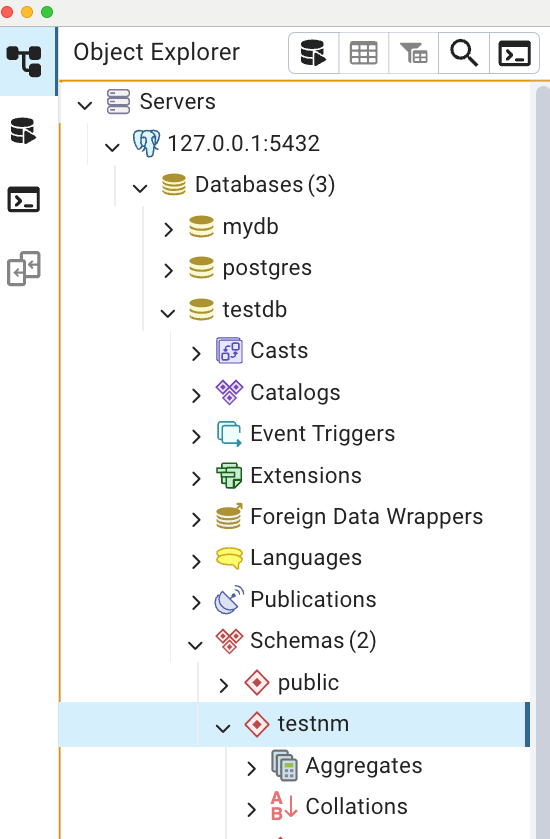
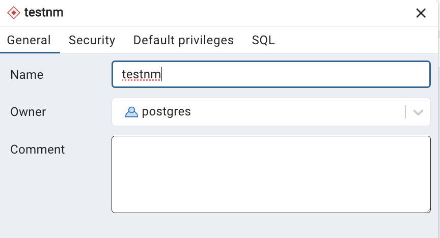
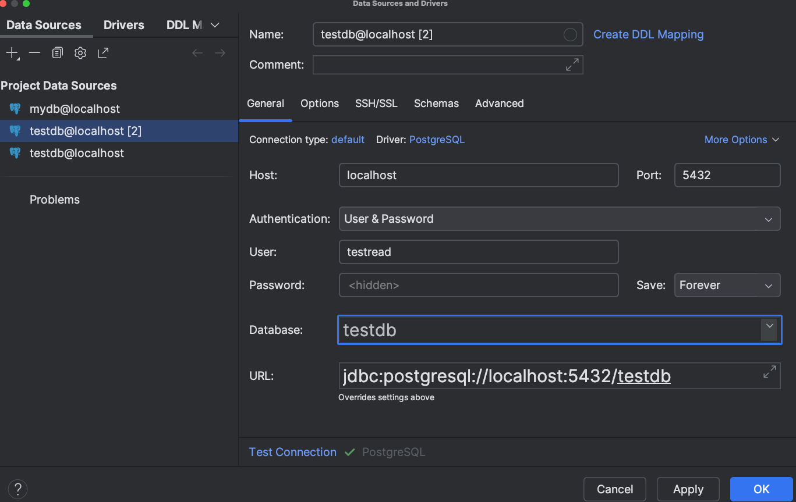

# Логический уровень PostgreSQL 
 Зашёл в кластер `127.0.0.1:5432` под пользователем `postgres` . Создал базу данных `testdb`.
  

```sql
--
-- СЕССИЯ 1 - под пользователем `postgres`, база данных `testdb`
-- 
create table t1(c1 integer); -- Cоздал новую таблицу `t1` с одной колонкой `c1` типа `integer`  
alter table t1 owner to postgres; 

insert into t1 values (1); -- вставил строку со значением `c1=1`
select * from t1; -- 1

create role readonly; -- создал новую роль readonly
SELECT * FROM pg_roles WHERE rolname = 'readonly';
-- +--------+--------+----------+-------------+-----------+-----------+--------------+------------+-----------+-------------+------------+---------+-----+
-- |rolname |rolsuper|rolinherit|rolcreaterole|rolcreatedb|rolcanlogin|rolreplication|rolconnlimit|rolpassword|rolvaliduntil|rolbypassrls|rolconfig|oid  |
-- +--------+--------+----------+-------------+-----------+-----------+--------------+------------+-----------+-------------+------------+---------+-----+
-- |readonly|false   |true      |false        |false      |false      |false         |-1          |********   |null         |false       |null     |33750|
-- +--------+--------+----------+-------------+-----------+-----------+--------------+------------+-----------+-------------+------------+---------+-----+

-- Даём новой роли `readonly` право на подключение к базе данных `testdb`
grant connect on DATABASE testdb TO readonly;
              
-- Даём новой роли право на использование схемы testnm
grant usage on SCHEMA testnm to readonly;
                      
-- Даём новой роли право на select для всех таблиц схемы testnm
grant SELECT on all TABLEs in SCHEMA testnm TO readonly;

-- Создаём пользователя testread с паролем test123
CREATE USER testread with password 'test123';
       
-- Даём роль readonly пользователю testread
grant readonly TO testread;
```

Заходим под пользователем `testread` в базу данных `testdb` 


```sql
--
-- СЕССИЯ 2 - под пользователем testread в базу данных testdb
--
select * from t1
-- Ошибка: [2025-06-29 10:53:47] [42501] ERROR: permission denied for table t1
-- Причина ошибки - Таблица t1 была создана в схеме public, а я дал права readonly на схему testnm, 
-- в которой нет таблицы t1.
```

```sql
--
-- СЕССИЯ 1 под пользователем `postgres`, база данных `testdb`
--
 
-- Овнером таблицы t1 является юзер postgres
SELECT schemaname, tablename, tableowner
FROM pg_tables
WHERE schemaname NOT IN ('pg_catalog', 'information_schema');
-- +----------+---------+----------+
-- |schemaname|tablename|tableowner|
-- +----------+---------+----------+
-- |public    |t1       |postgres  |
-- +----------+---------+----------+

-- Почему так получилось с таблицей t1? Потому что search_path = "$user", public 
SHOW search_path; 
-- +---------------+
-- |search_path    |
-- +---------------+
-- |"$user", public|
-- +---------------+ 
-- Схемы $USER нет, поэтому таблица по умолчанию создалась в public
     
drop table t1; -- Удаляем t1.
CREATE TABLE testnm.t1(c1 integer);  -- Создаём таблицу t1 заново, но уже с явным указанием имени схемы testnm
INSERT INTO testnm.t1 values(1);
SELECT * from testnm.t1;
-- +--+
-- |c1|
-- +--+
-- |1 |
-- +--+

```
```sql
--
-- СЕССИЯ 2 - под пользователем testread в базу данных testdb
--

select * from testnm.t1
-- [2025-06-29 11:21:07] [42501] ERROR: permission denied for table t1
-- потому что grant SELECT on all TABLEs in SCHEMA testnm TO readonly дал доступ только для существующих на тот момент 
-- времени таблиц, а t1 пересоздавалась
```
```sql
--
-- СЕССИЯ 1 под пользователем `postgres`, база данных `testdb`
--

-- Чтобы установить дефолтные привилегии SELECT на все будущие таблицы в схеме testnm для роли readonly:
ALTER DEFAULT PRIVILEGES IN SCHEMA testnm GRANT SELECT ON TABLES TO readonly;
-- ⚠️ команда должна быть выполнена от имени пользователя, который будет создавать таблицы в этой схеме. 
-- Только он может задать default privileges для своих объектов.
```

```sql
--
-- СЕССИЯ 2 - под пользователем testread в базу данных testdb
--

select * from testnm.t1
-- [2025-06-29 11:21:07] [42501] ERROR: permission denied for table t1
-- причина ошибки - Эта настройка 'ALTER DEFAULT PRIVILEGES IN SCHEMA testnm GRANT SELECT ON TABLES TO readonly;' 
-- влияет только на будущие таблицы, созданные владельцем схемы. Уже созданные таблицы нужно обработать вручную
```
```sql
--
-- СЕССИЯ 1 под пользователем `postgres`, база данных `testdb`
--
GRANT SELECT ON ALL TABLES IN SCHEMA testnm TO readonly;
```
```sql
--
-- СЕССИЯ 2 - под пользователем testread в базу данных testdb
--

select * from testnm.t1
-- +--+
-- |c1|
-- +--+
-- |1 |
-- +--+
-- Теперь получилось. Ура!

-- попробуём выполнить инсёрт
create table t2(c1 integer); insert into t2 values (2);
-- [2025-06-29 11:37:57] [42501] ERROR: permission denied for schema public
-- [2025-06-29 11:37:57] Позиция: 14
```
```sql
--
-- СЕССИЯ 1 под пользователем `postgres`, база данных `testdb`
--
 
 
-- проверим права пользователя readonly на схему public
SELECT n.nspname AS schema_name,
       r.rolname AS grantee,
       has_schema_privilege(r.rolname, n.nspname, 'USAGE') AS can_use,
       has_schema_privilege(r.rolname, n.nspname, 'CREATE') AS can_create
FROM pg_namespace n
JOIN pg_roles r ON r.rolname = 'readonly'
WHERE n.nspname = 'public';
-- +-----------+--------+-------+----------+
-- |schema_name|grantee |can_use|can_create|
-- +-----------+--------+-------+----------+
-- |public     |readonly|true   |false     |
-- +-----------+--------+-------+----------+

-- Проверка прав readonly на таблицы в схеме public
SELECT schemaname,
       tablename,
       has_table_privilege('readonly', schemaname || '.' || tablename, 'SELECT') AS can_select,
       has_table_privilege('readonly', schemaname || '.' || tablename, 'INSERT') AS can_insert,
       has_table_privilege('readonly', schemaname || '.' || tablename, 'UPDATE') AS can_update,
       has_table_privilege('readonly', schemaname || '.' || tablename, 'DELETE') AS can_delete
FROM pg_tables
WHERE schemaname = 'public';
-- ничего
```