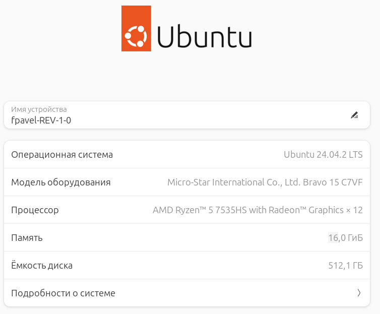
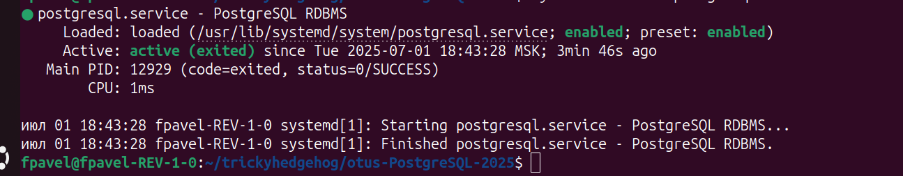
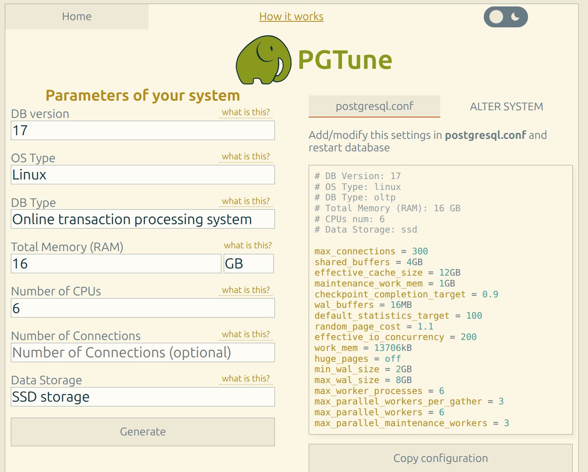
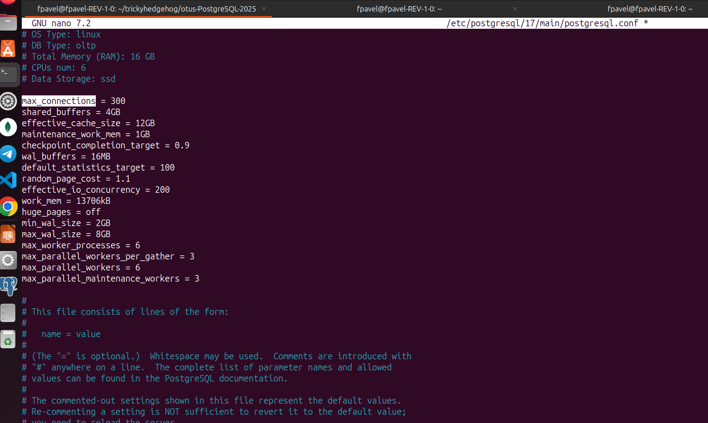
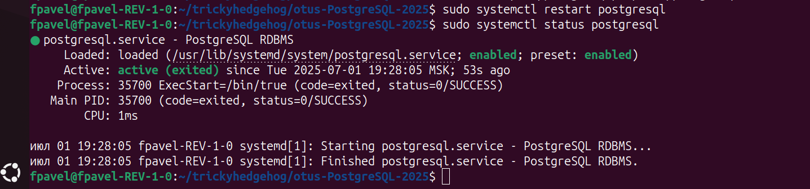

# Нагрузочное тестирование и тюнинг PostgreSQL

Установил локально постгрес



Рассчитал оптимальные параметры через PGTune


```shell
# DB Version: 17
# OS Type: linux
# DB Type: oltp
# Total Memory (RAM): 16 GB
# CPUs num: 6
# Data Storage: ssd

max_connections = 300
shared_buffers = 4GB
effective_cache_size = 12GB
maintenance_work_mem = 1GB
checkpoint_completion_target = 0.9
wal_buffers = 16MB
default_statistics_target = 100
random_page_cost = 1.1
effective_io_concurrency = 200
work_mem = 13706kB
huge_pages = off
min_wal_size = 2GB
max_wal_size = 8GB
max_worker_processes = 6
max_parallel_workers_per_gather = 3
max_parallel_workers = 6
max_parallel_maintenance_workers = 3
```

Внёс их в `/etc/postgresql/17/main/postgresql.conf`

Перезапустил постгрес
```shell
sudo systemctl restart postgresql
```

Сгенерил тестовые данные
```shell
fpavel@fpavel-REV-1-0:~/trickyhedgehog/otus-PostgreSQL-2025$ sudo -u postgres pgbench -i -s 10 testdb
dropping old tables...
ЗАМЕЧАНИЕ:  таблица "pgbench_accounts" не существует, пропускается
ЗАМЕЧАНИЕ:  таблица "pgbench_branches" не существует, пропускается
ЗАМЕЧАНИЕ:  таблица "pgbench_history" не существует, пропускается
ЗАМЕЧАНИЕ:  таблица "pgbench_tellers" не существует, пропускается
creating tables...
generating data (client-side)...
vacuuming...                                                                                
creating primary keys...
done in 1.14 s (drop tables 0.00 s, create tables 0.00 s, client-side generate 0.82 s, vacuum 0.09 s, primary keys 0.23 s).
```
Запустил бенчмарк - нагрузил кластер через утилиту через утилиту `pgbench`
```shell
fpavel@fpavel-REV-1-0:~/sysbench-tpcc$ sudo -u postgres pgbench -c 10 -j 2 -t 10000  testdb
[sudo] пароль для fpavel: 
pgbench (17.5 (Ubuntu 17.5-1.pgdg24.04+1))
starting vacuum...end.
transaction type: <builtin: TPC-B (sort of)>
scaling factor: 10
query mode: simple
number of clients: 10
number of threads: 2
maximum number of tries: 1
number of transactions per client: 10000
number of transactions actually processed: 100000/100000
number of failed transactions: 0 (0.000%)
latency average = 2.711 ms
initial connection time = 11.777 ms
tps = 3688.625151 (without initial connection time)

```
Изменил настройки для повышения производительности
```shell
# --- Общие параметры ---
shared_buffers = 4GB               # ~25% от RAM
work_mem = 64MB                    # на одну операцию сортировки/хеша
maintenance_work_mem = 512MB      # для VACUUM, CREATE INDEX и пр.

# --- WAL и синхронизация (ускорение, но менее надёжно) ---
fsync = off                        # отключить fsync (ускоряет, но небезопасно)
synchronous_commit = off          # не ждать записи WAL
full_page_writes = off            # отключить полные страницы

# --- WAL настройки ---
wal_buffers = 16MB
min_wal_size = 512MB
max_wal_size = 2GB

# --- Checkpoint ---
checkpoint_timeout = 30min
checkpoint_completion_target = 0.9

# --- Планировщик запросов ---
effective_cache_size = 10GB       # предполагаемый размер page cache ОС
random_page_cost = 1.1

# --- CPU ---
max_parallel_workers = 12
max_parallel_workers_per_gather = 6
parallel_setup_cost = 1000
parallel_tuple_cost = 0.1

# --- Соединения ---
max_connections = 100             # если тесты pgbench не превышают это число

```
Перезапустил постгрес и повторил бенчмарк
```shell
pavel@fpavel-REV-1-0:~/sysbench-tpcc$ sudo systemctl restart postgresql
fpavel@fpavel-REV-1-0:~/sysbench-tpcc$ sudo -u postgres pgbench -c 10 -j 2 -t 10000  testdb
pgbench (17.5 (Ubuntu 17.5-1.pgdg24.04+1))
starting vacuum...end.
transaction type: <builtin: TPC-B (sort of)>
scaling factor: 10
query mode: simple
number of clients: 10
number of threads: 2
maximum number of tries: 1
number of transactions per client: 10000
number of transactions actually processed: 100000/100000
number of failed transactions: 0 (0.000%)
latency average = 0.472 ms
initial connection time = 10.891 ms
tps = 21179.449665 (without initial connection time)

```
`tps` увеличился с `3688.625151` до `21179.449665`