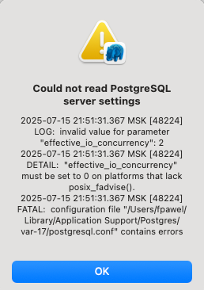

# Настройка autovacuum с учетом особеностей производительности

## System overview
- macOS 15.5
- MacBook Pro
- Apple M1 Pro 8 Cores (6 performance and 2 efficiency) 
- 16 GB RAM
- PostgreSQL (ver. 17.5 (Postgres.app)), запущен локально с дефолтными параметрами на порте 5432

## Homework

`/Users/fpawel/Library/'Application Support'/Postgres/var-17/postgresql.conf`
```shell
max_connections = 100			    # (change requires restart)
shared_buffers = 128MB			    # min 128kB
#effective_cache_size = 4GB
#wal_buffers = -1			        # min 32kB, -1 sets based on shared_buffers
#maintenance_work_mem = 64MB		# min 64kB
#autovacuum_work_mem = -1		    # min 64kB, or -1 to use maintenance_work_mem
#checkpoint_completion_target = 0.9	# checkpoint target duration, 0.0 - 1.0
#default_statistics_target = 100	# range 1-10000
#random_page_cost = 4.0			    # same scale as above
#effective_io_concurrency = 0		# 1-1000; 0 disables prefetching
#work_mem = 4MB				        # min 64kB
min_wal_size = 80MB
max_wal_size = 1GB
```

В SQL консоли получил действующие значения этих параметров
```shell
SELECT name, setting
FROM pg_settings
WHERE name IN ('max_connections', 'shared_buffers', 'effective_cache_size',
               'maintenance_work_mem', 'checkpoint_completion_target', 'wal_buffers',
              'default_statistics_target', 'random_page_cost', 'effective_io_concurrency',
              'work_mem', 'min_wal_size', 'max_wal_size');
```
```text
+----------------------------+-------+
|name                        |setting|
+----------------------------+-------+
|checkpoint_completion_target|0.9    |
|default_statistics_target   |100    |
|effective_cache_size        |524288 |
|effective_io_concurrency    |0      |
|maintenance_work_mem        |65536  |
|max_connections             |100    |
|max_wal_size                |1024   |
|min_wal_size                |80     |
|random_page_cost            |4      |
|shared_buffers              |16384  |
|wal_buffers                 |512    |
|work_mem                    |4096   |
+----------------------------+-------+

```
 

Создал БД для тестов
```shell
fpawel@MacBook-Pro-fpawel otus-PostgreSQL-2025 %  sudo -u postgres pgbench -i -s 10 testdb
Password:
dropping old tables...
NOTICE:  table "pgbench_accounts" does not exist, skipping
NOTICE:  table "pgbench_branches" does not exist, skipping
NOTICE:  table "pgbench_history" does not exist, skipping
NOTICE:  table "pgbench_tellers" does not exist, skipping
creating tables...
generating data (client-side)...
vacuuming...                                                                                
creating primary keys...
done in 3.91 s (drop tables 0.00 s, create tables 0.03 s, client-side generate 2.27 s, vacuum 0.50 s, primary keys 1.10 s).
```

Запустил pgbench

```shell
fpawel@MacBook-Pro-fpawel otus-PostgreSQL-2025 % pgbench -c8 -P 6 -T 60 -U postgres testdb  
pgbench (17.5 (Postgres.app))
starting vacuum...end.
progress: 6.0 s, 13397.5 tps, lat 0.575 ms stddev 0.508, 0 failed
progress: 12.0 s, 15989.4 tps, lat 0.497 ms stddev 0.486, 0 failed
progress: 18.0 s, 13195.7 tps, lat 0.603 ms stddev 0.621, 0 failed
progress: 24.0 s, 6317.6 tps, lat 1.263 ms stddev 41.835, 0 failed
progress: 30.0 s, 14479.8 tps, lat 0.549 ms stddev 1.310, 0 failed
progress: 36.0 s, 15640.1 tps, lat 0.508 ms stddev 0.367, 0 failed
progress: 42.0 s, 11543.1 tps, lat 0.686 ms stddev 1.334, 0 failed
progress: 48.0 s, 11020.2 tps, lat 0.720 ms stddev 1.070, 0 failed
progress: 54.0 s, 13694.2 tps, lat 0.580 ms stddev 2.718, 0 failed
progress: 60.0 s, 15581.1 tps, lat 0.510 ms stddev 0.427, 0 failed
transaction type: <builtin: TPC-B (sort of)>
scaling factor: 10
query mode: simple
number of clients: 8
number of threads: 1
maximum number of tries: 1
duration: 60 s
number of transactions actually processed: 785203
number of failed transactions: 0 (0.000%)
latency average = 0.605 ms
latency stddev = 9.266 ms
initial connection time = 188.760 ms
tps = 13125.158945 (without initial connection time)
```

Применил параметры настройки PostgreSQL из прикрепленного к материалам занятия файла
```text
max_connections = 40
shared_buffers = 1GB
effective_cache_size = 3GB
maintenance_work_mem = 512MB
checkpoint_completion_target = 0.9
wal_buffers = 16MB
default_statistics_target = 500
random_page_cost = 4
effective_io_concurrency = 2
work_mem = 6553kB
min_wal_size = 4GB
max_wal_size = 16GB
```
При попытке запустить постгрес с новыми параметрами получил ошибку

Поменял `effective_io_concurrency = 0` и постгрес запустился.

Убедился что параметры изменились 
```text
+----------------------------+-------+-------+
|name                        | стало |  было |
+----------------------------+-------+-------+
|checkpoint_completion_target|0.9    |0.9    |
|default_statistics_target   |500    |100    |
|effective_cache_size        |393216 |524288 |
|effective_io_concurrency    |0      |0      |
|maintenance_work_mem        |524288 |65536  |
|max_connections             |40     |100    |
|max_wal_size                |16384  |1024   |
|min_wal_size                |4096   |80     |
|random_page_cost            |4      |4      |
|shared_buffers              |131072 |16384  |
|wal_buffers                 |2048   |512    |
|work_mem                    |6553   |4096   |
+----------------------------+-------+-------+
```

## Основные различия в конфигурации:

### max_connections уменьшилось с 100 до 40.

Это ограничивает количество одновременных подключений к серверу, что может повлиять на производительность,
особенно при большом количестве клиентов в тесте.
Я использовал 8 клиентов, так что это не было ограничением, но в других тестах при большем количестве подключений это могло бы повлиять.

### shared_buffers уменьшилось с 16384 kB до 131072 kB (от 16 MB до 128 MB).

Это количество памяти, выделенной PostgreSQL для кеширования данных в памяти.
Уменьшение этого параметра может снизить производительность, так как меньше данных может быть закешировано в памяти,
что может привести к большему числу обращений к диску.

### work_mem увеличилось с 4096 kB до 6553 kB (с 4 MB до 6.5 MB).

Этот параметр отвечает за количество памяти, выделяемой для выполнения операций сортировки и хеширования в запросах.
Увеличение этого значения может повысить производительность при выполнении сложных операций сортировки или джойнов.

### maintenance_work_mem увеличилось с 65536 kB до 524288 kB (с 64 MB до 512 MB).

Это объем памяти, выделяемой для операций, таких как VACUUM, CREATE INDEX и другие задачи обслуживания.
Увеличение этого параметра может ускорить эти операции, но не влияет на производительность при выполнении обычных запросов.

### effective_cache_size увеличилось с 524288 kB до 393216 kB (с 512 MB до 384 MB).

Это количество памяти, которое PostgreSQL предполагает для использования операционной системой и другими приложениями.
Это больше влияет на планировщик запросов, который принимает решения о том, как использовать доступную память.
Уменьшение этого параметра может снизить оптимизацию запросов.

### max_wal_size и min_wal_size изменены (с 1024 MB и 80 MB до 16 GB и 4 GB соответственно).

Эти параметры управляют размерами журналов транзакций (WAL).
Увеличение этих значений позволяет избежать частых переключений между архивами WAL,
что может улучшить производительность при интенсивной записи в базу данных.

## Повторно запустил бенчмарк

```shell
fpawel@MacBook-Pro-fpawel otus-PostgreSQL-2025 % pgbench -c8 -P 6 -T 60 -U postgres testdb                                            
pgbench (17.5 (Postgres.app))
starting vacuum...end.
progress: 6.0 s, 15573.1 tps, lat 0.494 ms stddev 0.367, 0 failed
progress: 12.0 s, 18781.8 tps, lat 0.422 ms stddev 0.319, 0 failed
progress: 18.0 s, 18324.7 tps, lat 0.433 ms stddev 0.396, 0 failed
progress: 24.0 s, 18086.5 tps, lat 0.439 ms stddev 0.319, 0 failed
progress: 30.0 s, 17883.2 tps, lat 0.444 ms stddev 0.291, 0 failed
progress: 36.0 s, 12833.3 tps, lat 0.620 ms stddev 2.038, 0 failed
progress: 42.0 s, 16427.2 tps, lat 0.483 ms stddev 2.672, 0 failed
progress: 48.0 s, 17581.3 tps, lat 0.451 ms stddev 0.283, 0 failed
progress: 54.0 s, 17296.7 tps, lat 0.459 ms stddev 1.169, 0 failed
progress: 60.0 s, 17676.5 tps, lat 0.449 ms stddev 0.817, 0 failed
transaction type: <builtin: TPC-B (sort of)>
scaling factor: 10
query mode: simple
number of clients: 8
number of threads: 1
maximum number of tries: 1
duration: 60 s
number of transactions actually processed: 1022881
number of failed transactions: 0 (0.000%)
latency average = 0.464 ms
latency stddev = 1.131 ms
initial connection time = 193.058 ms
tps = 17100.248807 (without initial connection time)
```

Результаты теста `pgbench` изменились. 


### Количество памяти для кеширования данных (shared_buffers):

Уменьшение памяти для кеширования данных в памяти могло снизить общую производительность, 
так как система стала чаще обращаться к диску для чтения данных.

### Параметры, влияющие на работу с диском (effective_cache_size, work_mem):

Параметры, которые касаются кеширования и памяти для сортировок, также могут повлиять на быстродействие запросов. 
Увеличение `work_mem` могло улучшить обработку запросов с большими данными, 
но уменьшение других параметров, таких как `effective_cache_size`, могло негативно повлиять на производительность.

### Производительность с учетом количества подключений (max_connections):

Если количество подключений будет ближе к максимальному значению (например, при увеличении числа клиентов в pgbench), 
это может повлиять на производительность, так как серверу придется обрабатывать большее количество одновременных запросов.

### Изменение размеров WAL:

Увеличение размера WAL могло улучшить производительность, особенно при высоких нагрузках на запись, 
так как это уменьшает количество операций записи в журнал транзакций.

### Резюме:

Перезапуск бенчмарка показал, что изменения в конфигурации могли оказать как позитивное, 
так и негативное влияние на производительность. 
Уменьшение `shared_buffers` могло замедлить операции, связанные с чтением данных, 
а увеличение `work_mem` улучшило обработку больших запросов. 
Также, параметры, связанные с WAL и количеством подключений, могли повлиять на производительность в зависимости от нагрузки на систему.
 
## Создал таблицу с текстовым полем и заполнил случайными данным 1_000_000 строк.

```sql
CREATE TABLE test_table (
    id SERIAL PRIMARY KEY,
    text_field TEXT
);

INSERT INTO test_table (text_field)
SELECT
    substr(md5(random()::text), 1, 50) || substr(md5(random()::text), 1, 50)
FROM generate_series(1, 1000000);
-- [2025-07-15 22:18:58] 1,000,000 rows affected in 3 s 272 ms

SELECT COUNT(*) FROM test_table;
-- +-------+
-- |count  |
-- +-------+
-- |1000000|
-- +-------+

-- Посмотреть размер файла с таблицей
SELECT pg_size_pretty(pg_total_relation_size('test_table'));
-- +--------------+
-- |pg_size_pretty|
-- +--------------+
-- |118 MB        |
-- +--------------+

-- обновить всё несколько раз
UPDATE test_table
SET text_field = substr(md5(random()::text), 1, 50) || substr(md5(random()::text), 1, 50);

-- добавить случайный символ ко всем значениям
UPDATE test_table
SET text_field = text_field || chr(97 + floor(random() * 26)::int);


-- кол-во мёртвых строк
SELECT
    relname AS table_name,
    n_dead_tup AS dead_tuples
FROM
    pg_stat_user_tables
WHERE
    relname = 'test_table';
-- 1000000

-- когда был последний авто вакуум
SELECT
    relname AS table_name,
    last_autovacuum AS last_autovacuum_time
FROM
    pg_stat_user_tables
WHERE
    relname = 'test_table';
-- 2025-07-15 19:33:58.252786 +00:00
```

Спустя время кол-во мёртвых записей стало `0`, `last_autovacuum=2025-07-15 19:36:59.841901 +00:00`, а размер файла вырос до `530 MB`.

Далее 
- отключил авто вакуум для таблицы `test_table`
```sql
ALTER TABLE test_table SET (autovacuum_enabled = false);
```
- 10 раз обновил все строчки 
- добавил к каждой строчке случайный символ 

В результате размер файла таблицы стал `1222 MB`.

## Причина роста размера файла таблицы

- PostgreSQL использует механизм MVCC, чтобы поддерживать несколько версий строк для различных транзакций.
- апдейт с отключенным авто вакуумом приводит к накоплению мертвых строк (dead tuples) в таблице, 
которые не очищаются автоматически. 

При обновлении строк PostgreSQL не перезаписывает существующие строки. 
Вместо этого создаются новые версии строк, а старые становятся "мертвыми" (dead tuples). 
Автовакуум обычно удаляет эти мертвые строки, но если он отключен, они остаются в таблице.
Каждое обновление или добавление случайного символа может создавать новые версии строк, 
но старые версии остаются "мертвыми". 
Мертвые строки не удаляются, и пространство, которое они занимают, не освобождается, 
что увеличивает размер файла таблицы, так как база данных сохраняет как активные строки, так и мертвые.
Без автовакуума мертвые строки накапливаются, а место в файле таблицы используется неэффективно. 
Если добавить случайный символ, размер строки увеличивается, и создаются новые версии данных. 
Даже если данные остаются теми же, новые строки занимают дополнительное место в файле.
 
При каждом обновлении создается новая версия строки, и старые версии остаются в базе данных до тех пор, 
пока не будет выполнен процесс очистки (автовакуум или ручной VACUUM).


