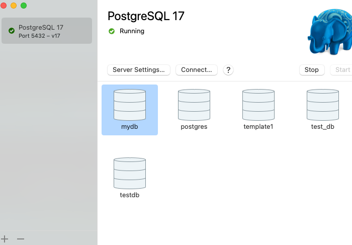

# Работа с журналами

## System overview
- macOS 15.5
- MacBook Pro
- Apple M1 Pro 8 Cores (6 performance and 2 efficiency)
- 16 GB RAM
- PostgreSQL (ver. 17.5 (Postgres.app)), запущен локально с дефолтными параметрами на порте 5432

## Homework

`/Users/fpawel/Library/'Application Support'/Postgres/var-17/postgresql.conf`
```shell
#checkpoint_timeout = 5min              # range 30s-1d
#checkpoint_completion_target = 0.9     # checkpoint target duration, 0.0 - 1.0
```

В SQL консоли получил действующие значения этих параметров
```shell
SHOW checkpoint_timeout;            -- 5min
SHOW checkpoint_completion_target;  -- 0.9
```

Настроил выполнение контрольной точки раз в 30 секунд.
Записал в `/Users/fpawel/Library/'Application Support'/Postgres/var-17/postgresql.conf`
```shell
checkpoint_timeout = 30s
```
Перезапустил Postgres.  
```shell
-- Проверил что значение `checkpoint_timeout` действительно `30s`
SHOW checkpoint_timeout; -- 30s

-- Пропылесосил
VACUUM FULL;
```

Директория с данными `Postgres`
```shell
export PGDATA=/Users/fpawel/Library/'Application Support'/Postgres/var-17
```

Удалил все журналы 
```shell
rm -f $PGDATA/pg_wal/*

ls -lh $PGDATA/pg_wal
total 0
drwx------@ 2 fpawel  staff    64B  9 июн 22:22 archive_status
drwx------@ 2 fpawel  staff    64B  9 июн 22:22 summaries
```


Подал на базу данных `testdb` нагрузку на 10 минут 
```shell
# "-c 10" 10 клиентов
# "-T 600" в течении 10 минут  
# "-P 1" выводить прогресс каждые 1 секунду 
# "-U postgres" от роли postgres
# "testdb" - имя базы данных
pgbench -T 600 -c 10 -P 1 -U postgres testdb

duration: 600 s
number of transactions actually processed: 9404483
number of failed transactions: 0 (0.000%)
latency average = 0.633 ms
latency stddev = 4.322 ms
initial connection time = 248.498 ms
tps = 15680.451937 (without initial connection time)
```

Сколько файлов WAL создалось
```shell
ls -l $PGDATA/pg_wal | wc -l
      52
```

Размер WAL файла 16 MB
```shell
fpawel@MacBook-Pro-fpawel otus-PostgreSQL-2025 % ls -lh $PGDATA/pg_wal
total 1605632
-rw-------@ 1 fpawel  staff    16M 16 июл 12:29 000000010000000700000020
-rw-------@ 1 fpawel  staff    16M 16 июл 12:26 000000010000000700000021
-rw-------@ 1 fpawel  staff    16M 16 июл 12:26 000000010000000700000022
-rw-------@ 1 fpawel  staff    16M 16 июл 12:26 000000010000000700000023
#...
-rw-------@ 1 fpawel  staff    16M 16 июл 12:27 00000001000000070000004F
-rw-------@ 1 fpawel  staff    16M 16 июл 12:27 000000010000000700000050
#...
```

За время теста было создано 20 контрольных точек - [postgres.checkpoints.log](png/007/postgres.checkpoints.log) - `postgres.checkpoints.log | wc -l # 20`.
Лог-файл [postgres.checkpoints.log](png/007/postgres.checkpoints.log) поучен из `$PGDATA/postgresql.log`

Объем журнальных файлов, созданных за 10 минут теста, `52 * 16 MB = 832 MB`.
Объем данных, записаных на одну контрольную точку `832 MB / 20 = 41.6 MB`.
Судя по ому, что в логах 20 записей,  все ли контрольные точки выполнялись точно по расписанию.

## Асинхронный режим

В асинхронном режиме `PostgreSQL` выполняет транзакции, не ожидая подтверждения записи в журнал транзакций (WAL), 
что увеличивает производительность, но также снижает гарантии целостности данных 
(если происходит сбой перед подтверждением записи).

Для того чтобы запустить `pgbench` в асинхронном режиме, нужно изменить параметр `synchronous_commit` 
в `PostgreSQL` на `off`, чтобы транзакции не ждали завершения записи в WAL перед продолжением. 

```sql
SET synchronous_commit TO OFF;
```

Запустил тест
```shell
pgbench -c 10 -T 600 -U postgres testdb

duration: 600 s
number of transactions actually processed: 10378151
number of failed transactions: 0 (0.000%)
latency average = 0.578 ms
initial connection time = 600.607 ms
tps = 17313.824533 (without initial connection time)
```

**В асинхронном режиме TPS выше `15680.451937` --> `17313.824533`, так как транзакции могут быть завершены быстрее, не ожидая записи в журнал.**

## Проверка data_checksums

В существующем кластере уже включена проверка контрольных сумм 
```sql
SHOW data_checksums;
-- on
```

Создаём новую базу данных и таблицу

```sql
create database test_db;
CREATE TABLE test_table (
                            id SERIAL PRIMARY KEY,
                            text_field TEXT
);

INSERT INTO test_table (text_field)
VALUES
    ('Value 1'),
    ('Value 2'),
    ('Value 3'),
    ('Value 4'),
    ('Value 5');

SELECT pg_relation_filepath('test_table');
-- +--------------------+
-- |pg_relation_filepath|
-- +--------------------+
-- |base/33760/42060    |
-- +--------------------+

SHOW data_directory;
-- +---------------------------------------------------------+
-- |data_directory                                           |
-- +---------------------------------------------------------+
-- |/Users/fpawel/Library/Application Support/Postgres/var-17|
-- +---------------------------------------------------------+
```
```shell
ls /Users/fpawel/Library/'Application Support'/Postgres/var-17/base/33760/42060 
/Users/fpawel/Library/Application Support/Postgres/var-17/base/33760/42060
```
Выключил кластер.

Использую команду `dd` для записи `FF` в первые 10 байтов файла:
```shell
dd if=/dev/zero of=/Users/fpawel/Library/'Application Support'/Postgres/var-17/base/33760/42060 bs=1 seek=0 count=10 conv=notrunc
10+0 records in
10+0 records out
10 bytes transferred in 0.000167 secs (59880 bytes/sec)
```
Включаю кластер обратно


Смотрю в таблицу - получаю ошибку
```sql
select * from test_table
-- [2025-07-17 19:13:21] [XX001] ERROR: invalid page in block 0 of relation base/33760/42060
```

Ошибка `invalid page in block 0 of relation base/33760/42060` указывает на повреждение страницы данных в файле таблицы. 
Причина этой ошибки в том, что я изменил несколько байтов в файле таблицы, что нарушило структуру данных `PostgreSQL` 
на уровне страниц. Когда `PostgreSQL` пытается прочитать поврежденную страницу, 
он обнаруживает ошибку и генерирует исключение invalid page.

# Как проигнорировать ошибку и продолжить работу?

Нельзя проигнорировать ошибку. `PostgreSQL` использует контрольные суммы страниц, чтобы обеспечить целостность данных. 
Если контрольная сумма страницы не совпадает с ожидаемой, `PostgreSQL` генерирует ошибку, 
чтобы избежать дальнейшего повреждения данных.

Даже если бы можно было игнорировать ошибку, поврежденные страницы могут привести к потере данных или неправильно 
выполненным операциям, что может ухудшить целостность базы данных.

Для продолжения работы можно игнорировать ошибку, оставив таблицу битой, либо восстановить таблицу из контрольной 
точки WAL или резервной копии.

Можно, например, настроить архивирование WAL, PostgreSQL будет сохранять файлы WAL в указанный каталог, например:
```sql
-- archive_mode = on
-- archive_command = 'cp %p /path/to/archive/%f'
SHOW archive_mode;
-- +------------+
-- |archive_mode|
-- +------------+
-- |on          |
-- +------------+

SHOW archive_command;
-- +----------------------------------+
-- |archive_command                   |
-- +----------------------------------+
-- |cp %p /Users/fpawel/pg_wal_arch/%f|
-- +----------------------------------+

```
### Восстановление с использованием WAL 
- останавливаем `PostgreSQL`
- добавляем в конфиг `PostgreSQL` `restore_command = 'cp "$PGDATA"/pg_wal/%f %p'`
- создаём файл сигнал `touch $PGDATA/recovery.signal`  
- и перезапускаем `PostgreSQL`
- после перезапуска сервер `PostgreSQL` автоматически выполнит восстановление.
- смотрим что в логах 
```shell
2025-07-18 10:40:48.596 MSK [39610] LOG:  database system is shut down
2025-07-18 10:41:11.183 MSK [39962] LOG:  starting PostgreSQL 17.5 (Postgres.app) on aarch64-apple-darwin23.6.0, compiled by Apple clang version 15.0.0 (clang-1500.3.9.4), 64-bit
2025-07-18 10:41:11.215 MSK [39962] LOG:  listening on IPv6 address "::1", port 5432
2025-07-18 10:41:11.215 MSK [39962] LOG:  listening on IPv4 address "127.0.0.1", port 5432
2025-07-18 10:41:11.229 MSK [39962] LOG:  listening on Unix socket "/tmp/.s.PGSQL.5432"
2025-07-18 10:41:11.237 MSK [39965] LOG:  database system was shut down at 2025-07-18 10:40:48 MSK
cp: /Users/fpawel/Library/Application Support/Postgres/var-17/pg_wal/00000004.history: No such file or directory
2025-07-18 10:41:11.258 MSK [39965] LOG:  restored log file "00000003.history" from archive
2025-07-18 10:41:11.276 MSK [39965] LOG:  restored log file "000000030000000900000003" from archive
2025-07-18 10:41:11.280 MSK [39965] LOG:  starting archive recovery
2025-07-18 10:41:11.284 MSK [39965] LOG:  consistent recovery state reached at 9/30000A0
2025-07-18 10:41:11.284 MSK [39965] LOG:  invalid record length at 9/30000A0: expected at least 24, got 0
2025-07-18 10:41:11.284 MSK [39965] LOG:  redo is not required
2025-07-18 10:41:11.284 MSK [39962] LOG:  database system is ready to accept read-only connections
2025-07-18 10:41:11.296 MSK [39965] LOG:  restored log file "000000030000000900000003" from archive
cp: /Users/fpawel/Library/Application Support/Postgres/var-17/pg_wal/00000004.history: No such file or directory
2025-07-18 10:41:11.307 MSK [39965] LOG:  selected new timeline ID: 4
2025-07-18 10:41:11.327 MSK [39965] LOG:  restored log file "00000003.history" from archive
2025-07-18 10:41:11.328 MSK [39965] LOG:  archive recovery complete
2025-07-18 10:41:11.329 MSK [39963] LOG:  checkpoint starting: end-of-recovery immediate wait
2025-07-18 10:41:11.333 MSK [39963] LOG:  checkpoint complete: wrote 3 buffers (0.0%); 0 WAL file(s) added, 0 removed, 1 recycled; write=0.002 s, sync=0.001 s, total=0.005 s; sync files=2, longest=0.001 s, average=0.001 s; distance=0 kB, estimate=0 kB; lsn=9/30000A0, redo lsn=9/30000A0
2025-07-18 10:41:11.340 MSK [39962] LOG:  database system is ready to accept connections
2025-07-18 10:41:11.373 MSK [39977] FATAL:  role "fpawel" does not exist
```
Теперь таблица `test_table` восстановлена.


